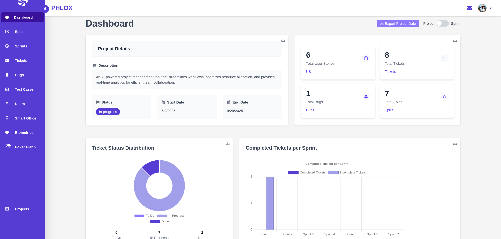
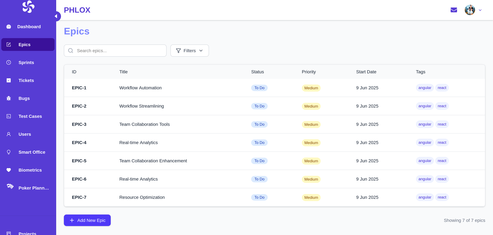
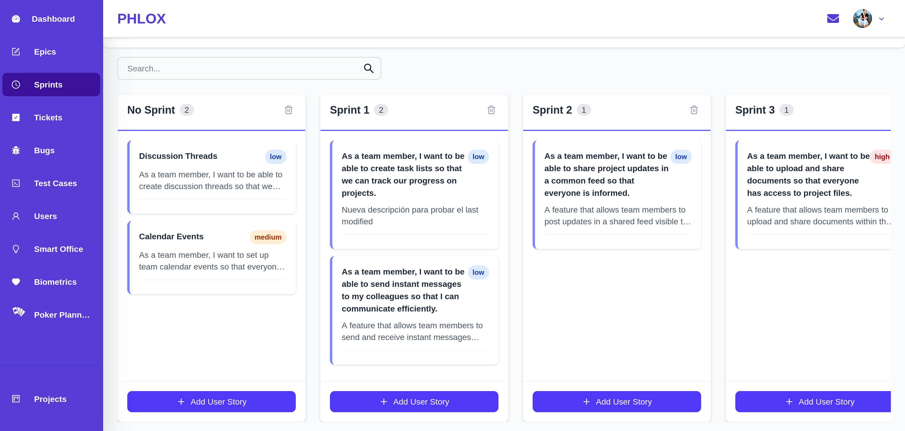
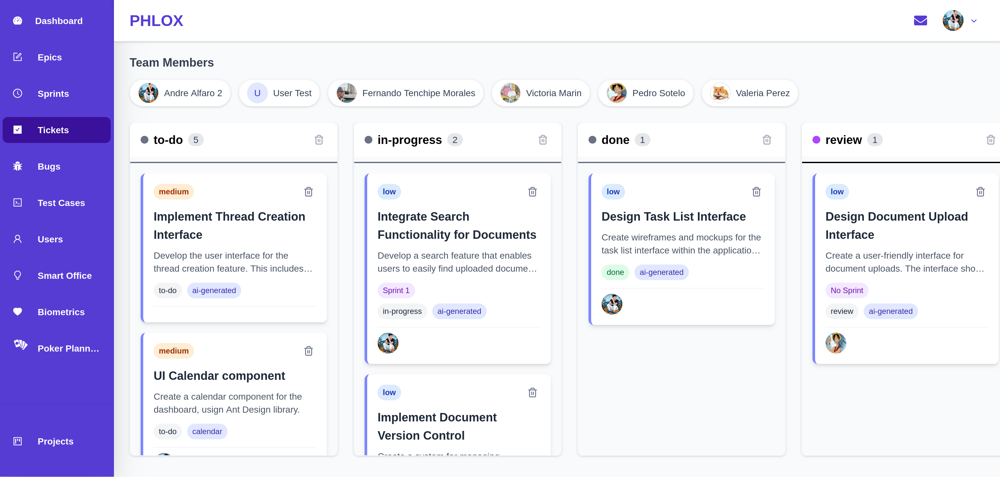
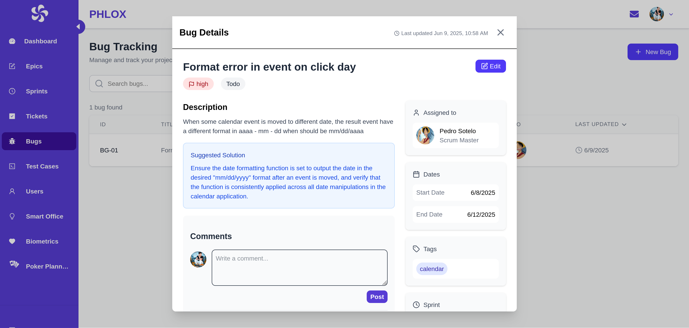
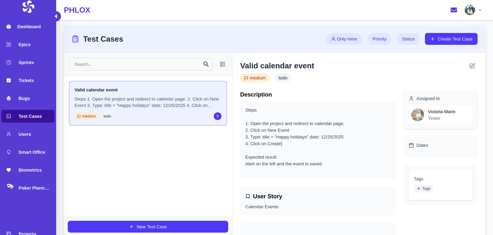
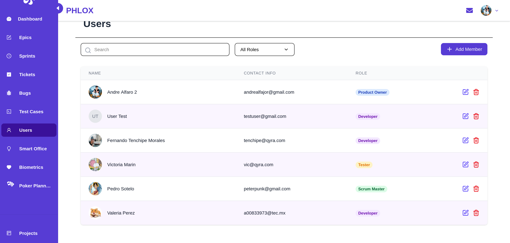
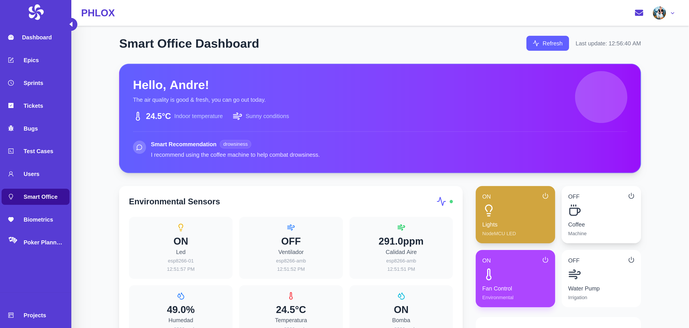
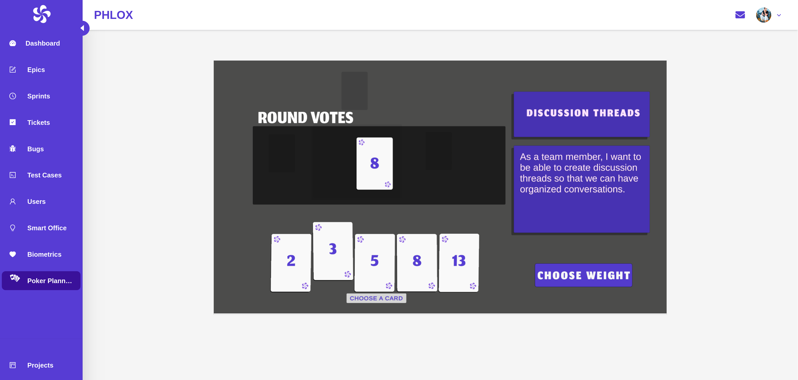

# User Interface Guide

This pages is an overview of Phlox's interface components.

[User Manual](https://www.canva.com/design/DAGp6fdLgfw/UZDuKcImgzcbXS6klfqD9g/edit?utm_content=DAGp6fdLgfw&utm_campaign=designshare&utm_medium=link2&utm_source=sharebutton)  

## Projects
Within this page, you can choose to enter a project you are part of, or create a new project from scratch.

## Navigating within a project

Once inside a project, there is a sidebar which the user can use to navigate between the different systems of the app.

### Dashboard

Contains various graphs displaying the team's performance in the entire project, and also by the current sprint:
- Project details containing description, status, and relevant dates
- Ticket status distribution
- Completed tickets per sprint
- Completed tickets per time
- Bug status
- Sprint progress percentage
- Assigned tickets
- Developer workload
- Button to download a .csv file containing all the information

### Epics

Manage project epics:
- Create epics manually
- Create epics with AI using the project description
- Create user stories based on the epic with AI

### Sprints

Manage project sprints as well as the user stories:
- Drag and drop kanban-style system with columns symbolizing sprints
- Create user story with AI or manually
- Create new sprint columns
- Suggest sprint planning with AI
- Search user stories by various filters (name, status, priority, etc)
- Create tickets using AI based on a user story
- Create test cases based on the user story description

### Tickets

Manage project tickets, assign, create, delete:
- Drag and drop kanban-style system with columns symbolizing different statuses
- Create tickets with AI  
- Assign tickets to other developers
- Mark tickets as completed or as any other status

### Bugs

Manage project bugs and ask for suggestions:
- Create a new bug and assign it to a ticket
- Ask the AI for suggestions regarding the solution to the bug
- Assign bug to developers and mark them as completed

### Test Cases

Manage project tests cases:
- Create a new test case and assign it to a user story
- Assign test cases to developers and mark them as completed

### Users

Manage team members and access permissions within a project:
- User List Table: displays user name, role, status, and last activity.
- Search & Filters: find users by name, role, or status.
- Add/Edit User: forms to invite new users or edit existing ones (role, bio, permissions).
- User Status Controls: enable/disable users, reactivate, or resend invitations.

### Smart Office

Central hub to streamline office-related workflows and resources:
- Quick actions for controlling various sensors and actuators like lights, fans, coffe machine and water pumps
- Dashboard displaying all of the sensor readings in the office
- AI recommendations based on the current status
- Access logs displaying everyone that has entered or exit the office

### Biometrics
Page to start a biometrics session for helping scrum masters manage their teims better:
- Start a new session using a **Muse** headband
- Ask AI for suggesitons regarding the current users state
- View the graph and readings of the current session

### Poker Planning

Play a poker planning session to decide the weight of the user stories:
- Start a poker session
- Vote on rounds
- Decide final weights

